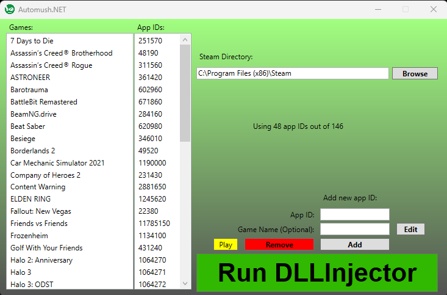

# Automush
A Steam app ID manager for GreenLuma / DLLInjector

### Set Up:
***Requires*** **.NET 8.0**. Get it here: https://dotnet.microsoft.com/en-us/download/dotnet/8.0

Download the latest release (Automush 1.0.1)

If your DLLinjector.exe is not in the default Steam folder **C:\Program Files (x86)\Steam\DLLInjector.exe**,
then click **Browse** and set the correct location, otherwise you are good to go.

### Features:
Synchronized scroll bars to display and edit your list of app IDs.

Remove app IDs by clicking on their name *or* the app ID and hit **Remove**.

Add app IDs by typing in the app ID and *optional* name then hit **Add**.

Start DLLInjector with the **Run DLLInjector** button
